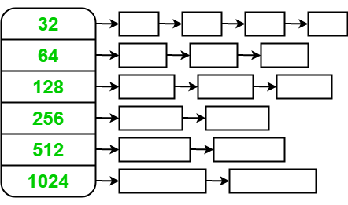
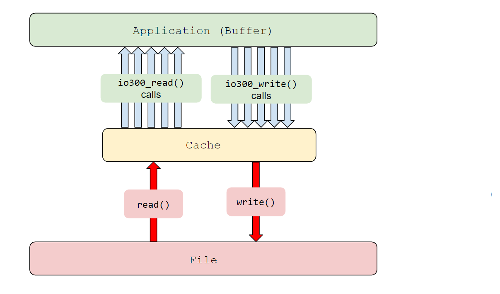
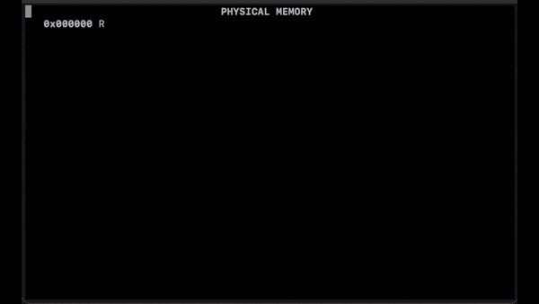
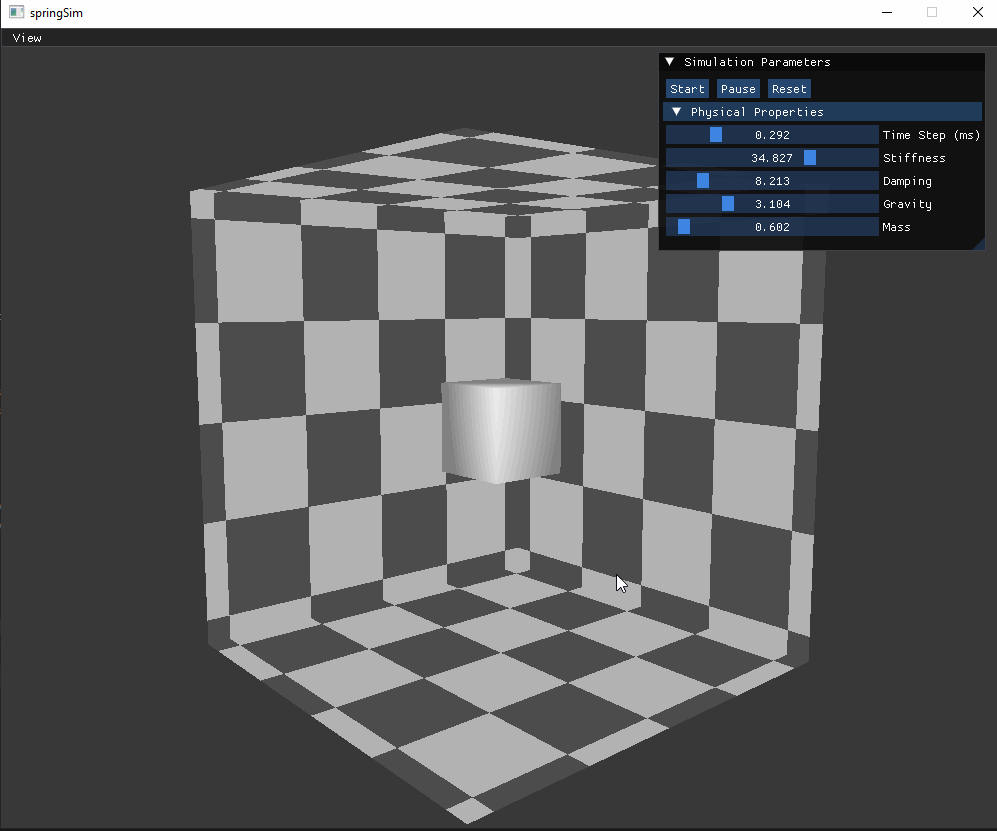
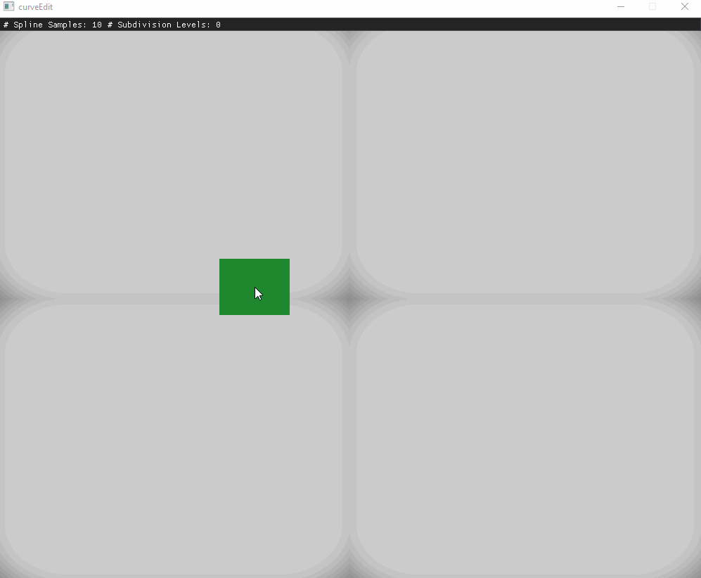
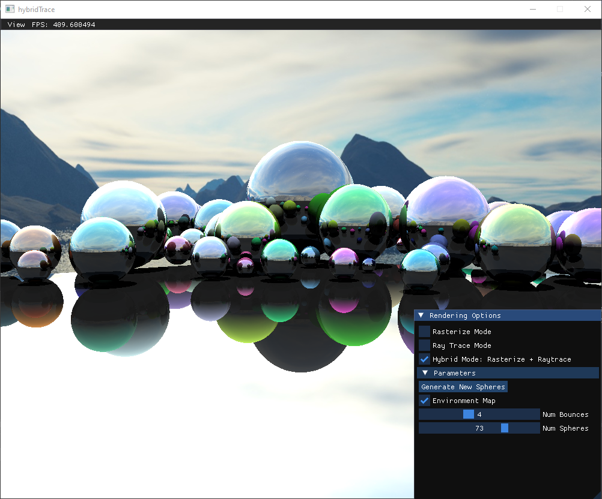
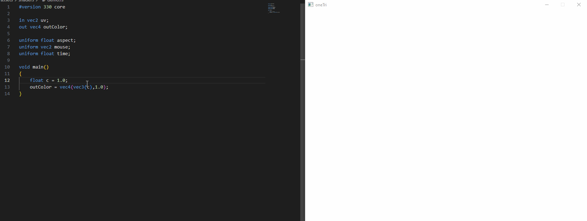
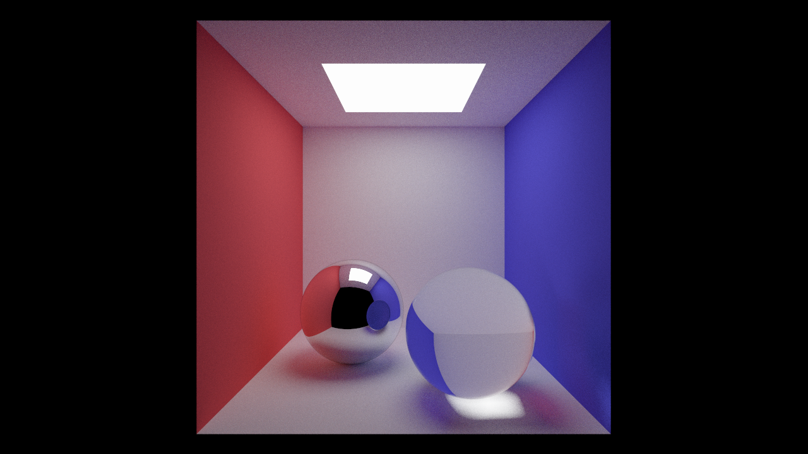
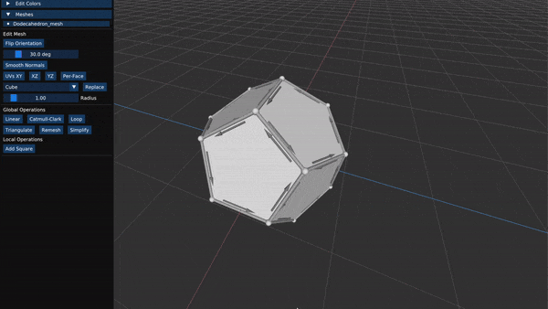
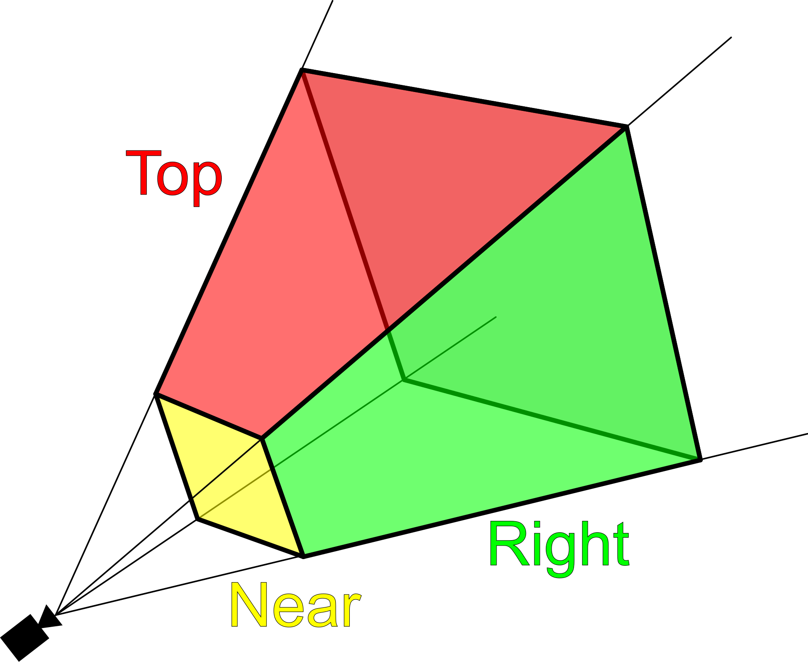

### Tags: C,C/C++,Rust,Systems,Graphics,OpenGL,Vulkan,Unity

## dmalloc  
#### [C,Systems]

 
 

A user-level dynamic memory allocator that helps to debug common dynamic memory usage errors (e.g. error after free, write out of bounds, etc).

## bytebuf 

#### [C,Systems]

 
 

A user-level library that provides a wrapper around a few POSIX compliant sys calls.
The implementation uses a cache to speed up access to data and reduce the number of disk operations required for common syscalls like read, write, and seek.

## vmem 

#### [C,Systems]

 
 

A virtual-memory system implementation for a toy operating system. On top of the virtual memory system are common syscall implementations for managing different processes like fork and exec.

## subsurface 

#### [Unity,Graphics]

 

 

A game I made recently for a game jam to learn Unity and to experiment with Unity's shader graph system.

## lightbx 
#### [C/C++,Vulkan,Graphics]

 
 

First vulkan project, where I was experimenting with instanced objects and light sources.

## springsim 

#### [C/C++,OpenGL,Graphics]

 
 

An implementation of a soft-body simulator based on a spring-based physical model.

## sceneview 

#### [C/C++,OpenGL,Graphics]

 
 

Simple application for viewing 3d meshes lit with the phong shading model.

## curveedit 

#### [C/C++,OpenGL,Graphics]

 
 

Application for editing and visualizing common curve representations.
Includes things like Bezier curves, Bsplines, and Subdivision curves.

## hybridtrace 

#### [C/C++,OpenGL,Graphics]

 
 

Real-time GPU based application for comparing traditional triangle rasterization and ray tracing. Some of the main visual effects ray tracing provides that rasterization doesn't (out of the box) in this case are: shadows and multi-bounce reflections.

## shaderfx 

#### [C/C++,OpenGL,Graphics]

 
 

An application for playing around with shader visual effects on 3d meshes.
Includes things like vertex warping and post-processing effects.

## onetri 

#### [C/C++,OpenGL,Graphics]

 
 

    A program meant to be used to live-code fragment shaders in real-time.

## radiance 

#### [C/C++,Graphics]

 
 

My physically based path tracer.
Contains features such as: a BVH acceleration structure, direct light sampling, environment map sampling, and various BSDF materials.

## hitomezashi 

#### [Rust,Graphics]

 
 

My first graphics project in Rust using the library nannou.
I was playing around with ways to color structures generated from
Hitomezashi <a href="https://sakepuppets.com/2013/10/02/hitomezashi-sashiko-a-tutorial/">stitching</a> 
patterns.

## meshedit 

#### [C/C++,OpenGL,Graphics]

 
 

A 3D model editing program with an implementation of the half-edge data structure.

## gmath 

#### [C/C++,Graphics]

 
 

A custom math library that I use in most of my graphics projects.

