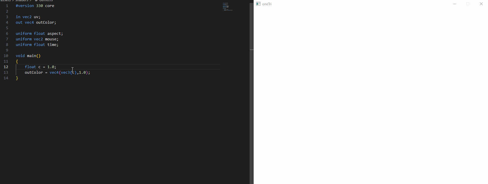

## dmalloc
 
 
[github](https://github.com/eqdiag/brownCS1310/tree/main/cs300-s23-projects/dmalloc)

TODO: Malloc image

## bytebuf

 
 
[github](https://github.com/eqdiag/brownCS1310/tree/main/cs300-s23-projects/weensyos)

TODO: buffer image

## weensy

 
 
[github](https://github.com/eqdiag/brownCS1310/tree/main/cs300-s23-projects/weensyos)

TODO: buffer image

## lightbx

 
 
[github](https://github.com/eqdiag/lightBx)

vulkan hurrah lighbx..should add gamma corrected bby real quick

## lightfx

 
 
[github](https://github.com/eqdiag/lightFx)

A Vulkan implementation of various real-time rendering effects.

## radiance

 
 
[github](https://github.com/eqdiag/myScotty3d/blob/main/README_A3.md)

My main path tracer project.
Supports loading scene files in the <a href="http://www.mitsuba-renderer.org/">mitusba</a> 
xml format.

## springsim

 
 
[github](https://github.com/eqdiag/springSim)

An implementation of a soft-body simulator based on a spring-based physical model.

## sceneview

 
 
[github](https://github.com/eqdiag/myScotty3d/blob/main/README_A3.md)

## curveedit

 
 
[github](https://github.com/eqdiag/myScotty3d/blob/main/README_A3.md)

Application for editing and visualizing common curve representations.
Includes things like Bezier curves, Bsplines, and Subdivision curves.

## hybridtrace

 
 
[github](https://github.com/eqdiag/myScotty3d/blob/main/README_A3.md)

Real-time GPU based (OpenGL) application for comparing traditional triangle rasterization and ray tracing. Some of the main visual effects ray tracing provides that rasterization doesn't (out of the box) in this case are: shadows and multi-bounce reflections.

## shaderfx

 
 
[github](https://github.com/eqdiag/shaderFx)

An application for playing around with shader visual effects on 3d meshes.
Includes things like vertex warping and post-processing effects.

## onetri

 
 
[github](https://github.com/eqdiag/oneTri)

    A program meant to be used to live-code fragment shaders in real-time.

## ptrace

 
 
[github](https://github.com/eqdiag/myScotty3d/blob/main/README_A3.md)

A toy physically-based path tracer.
Contains features such as: a BVH acceleration structure, direct light sampling, environment map sampling, and various BSDF materials.

## hitomezashi

 
 
[github](https://github.com/eqdiag/hitomezashi)

My first graphics project in Rust using the library nannou.
I was playing around with ways to color structures generated from
Hitomezashi <a href="https://sakepuppets.com/2013/10/02/hitomezashi-sashiko-a-tutorial/">stitching</a> 
patterns.

## meshedit

 
 
[github](https://github.com/eqdiag/myScotty3d/blob/main/README_A2.md)

A 3D model editing program with an implementation of the half-edge data structure.

## gmath

 
 
[github](https://github.com/eqdiag/myScotty3d/blob/main/README_A3.md)

A custom math library that I use in most of my graphics projects.

## gkernel

 
 
[github](https://github.com/eqdiag/myScotty3d/blob/main/README_A3.md)

A wrapper library that I've used for my OpenGL projects. 

---
{: data-content="Sketches"}
| l-systems |
| guitar triads & scales series | 

---
{: data-content="Shaders"}
| shader0 | 
